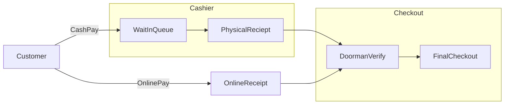

<h1 align="center">
        <samp>&gt;
                <b><a target="_blank" href="http://rapidreceipt.techfestsliet.org/prerequisite">Rapid~receipt 📝</a></b>
        </samp>
</h1>
<p align="center" style="color:red"> 
  <samp>
    <br>
    「 Scan, Shop, Verify :: Your shoping companion 」
    <br>
    <br>
  </samp>
         
</p>

[ppt link](https://docs.google.com/presentation/d/11gI5HQ7mO3mREH3Dks0aeecER4kXmctR/edit?usp=sharing&ouid=117849667244297270354&rtpof=true&sd=true)
## Project Problem Overview 😺
## Problems

### Problem 1: Inefficient Checkout Process

In today's digital world, time is a precious commodity. However, many grocery store checkouts still require customers to wait in line, even for single items. This process is not only inefficient but also contributes to customer frustration and lost productivity. Moreover, the traditional checkout process, with its physical receipts and manual verification, is prone to errors and can lead to delays and customer dissatisfaction.


**Merits of an Improved Checkout Process:**

- **Reduced Wait Times:** Implementing self-checkout options or streamlining the traditional checkout process can significantly reduce customer wait times, saving valuable time for both customers and employees.

- **Enhanced Customer Experience:** A faster and more convenient checkout process can significantly improve customer satisfaction and loyalty.

- **Improved Efficiency:** A more efficient checkout process can lead to increased sales and reduced labor costs for businesses.

### Problem 2: Lack of Record-Keeping in Small Businesses

Many small businesses (e.g., cart vendors) struggle to maintain accurate and up-to-date records of their sales and inventory. This lack of record-keeping can lead to a number of problems, including:

- **Inaccurate Financial Reporting:** Without accurate records, businesses cannot accurately track their income and expenses, making it difficult to make informed financial decisions.

- **Inventory Management Issues:** Poor record-keeping can make it difficult to track inventory levels, leading to stockouts and overstocking, both of which can negatively impact profits.

- **Tax Compliance Challenges:** Accurate records are essential for tax compliance. Without them, businesses may face penalties or audits.

**Merits of Improved Record-Keeping:**

- **Enhanced Financial Management:** Accurate records enable businesses to make informed financial decisions, track profitability, and identify areas for improvement.

<center>
        
</center>
# RapidReceipt: Streamlining Financial Transactions

**Project Overview:** 
"RapidReceipt" is an innovative project focused on streamlining and expediting the receipt and payment process for both consumers and businesses. It offers a seamless solution for reducing the time and effort traditionally spent on financial transactions. Here's a brief overview.

**RapidReceipt Features:**

- **Elimination of Intermediaries:** RapidReceipt is a revolutionary platform designed to eliminate the need for intermediaries, such as cashiers, in the payment process.

- **Efficient Payment Process:** It leverages cutting-edge technologies to empower users to make quick and hassle-free payments by scanning product barcodes.

- **Admin Panel:** The system is driven by an admin panel that allows for easy product definition and management.

**For Businesses:**

- **Product Management:** Businesses can easily define, update, and manage products available for scanning through the admin panel.

- **Inclusivity:** Even small businesses like cart vendors can efficiently manage their business portfolios using RapidReceipt.

RapidReceipt is a game-changer in the world of financial transactions, simplifying the payment process and providing businesses with powerful tools for product management. It's the future of hassle-free payments.


## Solution



## Features 📑
- Instant scanning
- Quick and easy payments
- Intuitive user interface
- Enhanced User Experience

## Table of Contents 📑

- [🗒️Getting Started](#getting-started)
- [💡Usage](#usage)
- [📦Installation](#installation)
- [👩‍💻Contributing](#contributing)
- [🉑License](#license)

## 🗒️Getting Started
<a name="getting-started"></a>
Our project is an example of how innovative technology and streamlined processes can significantly improve the efficiency and user experience in the realm of payment and transactions. It showcases how leveraging modern solutions can lead.

## 💡Usage
This section provides instructions on how to use the Rapid Receipt application.

1. Ensure you have completed the installation process as described in the [Installation](#installation) section.

2. Start the Rapid Receipt application by following the [Start the Application](#start-the-application) instructions in the installation guide.

3. Access the application by opening your web browser and navigating to [http://localhost:3000](http://localhost:3000).

## User Guide

### Scanning Products

1. On the homepage, click the "Scan Barcode" button.
   

3. Use your device's camera to scan the barcode of the product.
   

5. The scanned product information will be displayed on the screen.
## Admin Side
### Adding Products Manually

1. Click the "Add Product" button on the homepage.


3. Fill in the product details, such as name, description, and price.


5. Click "Save" to add the product to the database.

### Viewing and Managing Products

1. Navigate to the "Products" section to view the list of all scanned and manually added products.

2. You can edit or delete product information by clicking on the respective product entry.


### Generating Receipts

1. Go to the "Receipts" section to generate and view receipts.


3. Select the products you want to include in the receipt.


4. Click "Generate Receipt" to create a receipt with the selected products.


## Example Use Cases

Here are some common scenarios where Rapid Receipt can be particularly useful:

- Retail stores for fast product scanning and receipt generation.
- Inventory management to keep track of products.
- Event organizers for ticket scanning and registration.
## 📦Installation
Follow these steps to install and set up Rapid Receipt on your local machine.

### Prerequisites

Before you begin, ensure you have the following prerequisites installed:

- [Node.js](https://nodejs.org/) (with npm)
- [Flutter](https://www.Flutter.com/) (for running Mobile App Scanner)
- [MongoDb Atlas](https://mongoDb.com)(for running Database)
- [Git](https://git-scm.com/)
- [Python3](Taipy library use for front end coding)
### Install Dependencies
-CLIENT SIDE:
-Admin Panel[Vendors]
```bash
pip install taipy
  
```
-End User[Customers]
```bash
 flutter create appname
  
```  
-BackEnd[Node.js,MongoDB Atlas]
```bash
npm install
npm start
  
```
 

## Feature Requests

If you have a feature or enhancement in mind that would benefit Rapid Receipt, you can submit a feature request by following these guidelines:

- Create a detailed and clear description of the proposed feature.
- Explain how the feature would benefit the project.
- Include any relevant technical details or examples.

## Pull Requests

We encourage you to submit pull requests to contribute code changes or improvements to the project. Here's how to do it:

1. Fork the Rapid Receipt repository to your own GitHub account.

2. Creaste a new branch for your feature or bug fix:

   ```bash
   git checkout -b feature-or-bugfix-name

```bash
## Frequently Asked Questions
### Question
### How do I install app.
## License

Rapid Receipt is open-source software licensed under the [MIT License](LICENSE).
